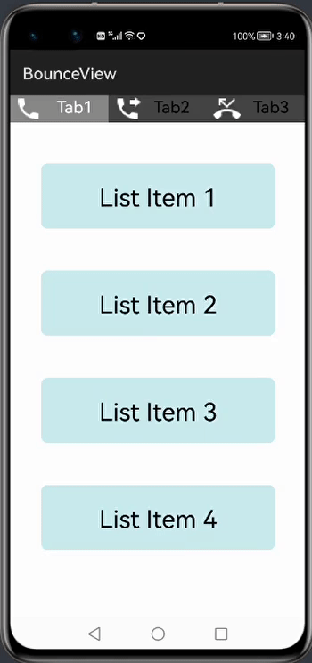
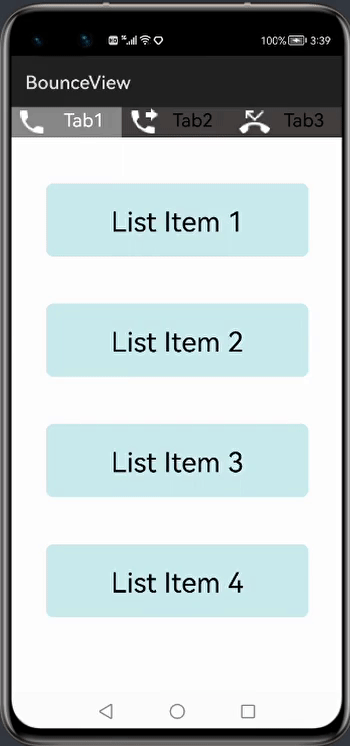
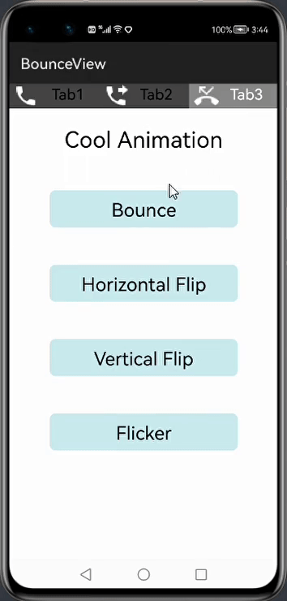

[](https://github.com/applibgroup/Bounceview-Ohos/actions/workflows/main.yml)
[](https://sonarcloud.io/dashboard?id=applibgroup_Bounceview-Ohos)
# Bounceview-Ohos
Its an HarmonyOS library that provides customizable bounce animation for any component update

## Source
Inspired by https://github.com/hariprasanths/Bounceview-Android Version v0.2.0

## Screenshot
#### Bounceview attached to TabList and List items
 
#### Bounceview attached to CustomDialogs and some cool animations
 

# Getting Started
## Installation Instructions
1.For using Bounceview-Ohos module in sample app, include the source code and add the below dependencies in entry/build.gradle to generate hap/support.har.
```groovy
	dependencies {
		implementation project(path: ':bounceview-ohos')
        	implementation fileTree(dir: 'libs', include: ['*.har'])
        	testImplementation 'junit:junit:4.13'
	}
```
2.For using Bounceview-Ohos in separate application using har file, add the har file in the entry/libs folder and add the dependencies in entry/build.gradle file.
```groovy
	dependencies {
		implementation fileTree(dir: 'libs', include: ['*.har'])
		testImplementation 'junit:junit:4.13'
	}
```
3. For using Bounceview-Ohos from a remote repository in separate application, add the below dependencies in entry/build.gradle file.
```groovy
        dependencies {
                implementation 'dev.applibgroup:bounceview-ohos:1.0.0'
                testCompile 'junit:junit:4.13'
        }
```
## Usage

### Add animations to any components as below:

```java
Button button = (Button) findComponentById(ResourceTable.Id_button);
BounceView.addAnimTo(button);
```

### Use BounceView with dialogs:
CustomDialog is our custom class extending CommonDialog created for Bounce View animnation. Most of the functionalities will be similar to CommonDialog provided by HMOS platform.
<br>
Custom dialog is divided into three parts :
  1. title component
  2. content component
  3. button component
  <br>
User can set the custom layout for 1 & 2. If not set, baselayout will be set. But for button component similar to CommonDialog behaviour, user will not be able to customize the Button layout .
<br>
In case user wants to customize the button layout, it is still possible by adding the customized buttons within the layout created for content component 

```
customDialog.setContentCustomComponent(customComponent);
```

#### a) Create Alert Dialog using CustomDialog 
```java
// CustomDialog (Alert Dialog creation) when you directly set text, contents or button
CustomDialog alertDialog = new CustomDialog(getContext());
alertDialog.setTitleText("Alert Dialog");
alertDialog.setContentText("Do you want to exit?");
alertDialog.setCommonButton(0, "No", 100, 0, component12 -> alertDialog.destroy());
alertDialog.setCommonButton(1, "Yes", 100, 0, component1 -> terminateAbility());
alertDialog.setSize(400, 300);
alertDialog.setAutoClosable(true);
alertDialog.show();
BounceView.addAnimTo(alertDialog);  // always add BounceView after .show() is called
```

#### b) CustomDialog with customized layout by user
```java
// CustomDialog when you set customComponent
CustomDialog commonDialog = new CustomDialog(getContext());
DirectionalLayout customDialog = (DirectionalLayout) LayoutScatter.getInstance(getContext())
        .parse(ResourceTable.Layout_custom_dialog, null, false); 
// this Layout_custom_dialog may contain buttons(or any other components) and you can also add bounceview to it as shown above for components.
commonDialog.setContentCustomComponent(customDialog);
commonDialog.setAutoClosable(true);
commonDialog.show();
BounceView.addAnimTo(commonDialog); // always add BounceView after .show() is called
```

#### c) Adding the customized layout to Custom popup Dialog 

```java
CustomPopupDialog 
DirectionalLayout customDialogLayout = (DirectionalLayout) LayoutScatter.getInstance(getContext())
        .parse(ResourceTable.Layout_custom_popup, null, false);
CustomPopupDialog popupDialog = new CustomPopupDialog(getContext(), null); // can pass custom component and Dialog box width and height will be set to that of custom component
popupDialog.setCustomComponent(customDialogLayout);
popupDialog.setAutoClosable(true);
popupDialog.show();
BounceView.addAnimTo(popupDialog); // always add BounceView after .show() is called
```

CustomPopupDialog is our custom class extending PopupDialog created for Bounce View animnation. Most of the functionalities will be similar to PopupDialog provided by HMOS platform. 
When you try to create default popup dialog by using ```setText("Hello World")``` or ```setBackColor(color)``` directly, these will be set to our defined base Layout in the library.

### Some cool animations:

```java
//Bounce animation
BounceView.addAnimTo(button1)
        .setScaleForPopOutAnim(1.1f, 1.1f);

//Horizontal flip animation
BounceView.addAnimTo(button2)
        .setScaleForPopOutAnim(1f, 0f);

//Vertical flip animation
BounceView.addAnimTo(button3)
        .setScaleForPopOutAnim(0f, 1f);

//Flicker animation
BounceView.addAnimTo(button4)
        .setScaleForPopOutAnim(0f, 0f);
```

### Customize BounceView properties:

```java
Button button = (Button) findComponentById(ResourceTable.Id_button);
BounceView.addAnimTo(button)
        //Default push in scalex: 0.9f , scaley: 0.9f
        .setScaleForPushInAnim(BounceView.PUSH_IN_SCALE_X, BounceView.PUSH_IN_SCALE_Y)
        //Default pop out scalex: 1.1f, scaley: 1.1f
        .setScaleForPopOutAnim(BounceView.POP_OUT_SCALE_X, BounceView.POP_OUT_SCALE_Y)
        //Default push in anim duration: 100 (in milliseconds)
        .setPushInAnimDuration(BounceView.PUSH_IN_ANIM_DURATION)
        //Default pop out anim duration: 100 (in milliseconds)
        .setPopOutAnimDuration(BounceView.POP_OUT_ANIM_DURATION)
        //Default interpolator: Animator.CurveType.ACCELERATE_DECELERATE
        .setInterpolatorPushIn(BounceView.DEFAULT_INTERPOLATOR)
        .setInterpolatorPopOut(BounceView.DEFAULT_INTERPOLATOR);
```

## Show your support

Give a :star: if this project helped you!

## License

Copyright :copyright: 2018 [Hariprasanth S](https://github.com/hariprasanths)

This project is licensed under [the Apache License, Version 2.0](https://github.com/hariprasanths/Bounceview-Android/blob/master/LICENSE)
<br/>You may also obtain a copy of the License at

http://www.apache.org/licenses/LICENSE-2.0
